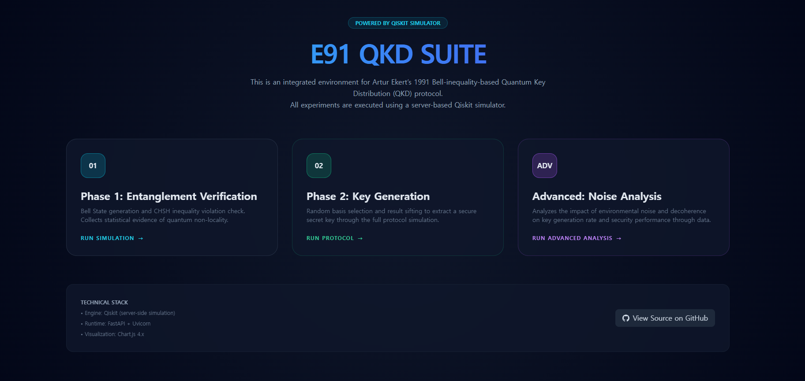
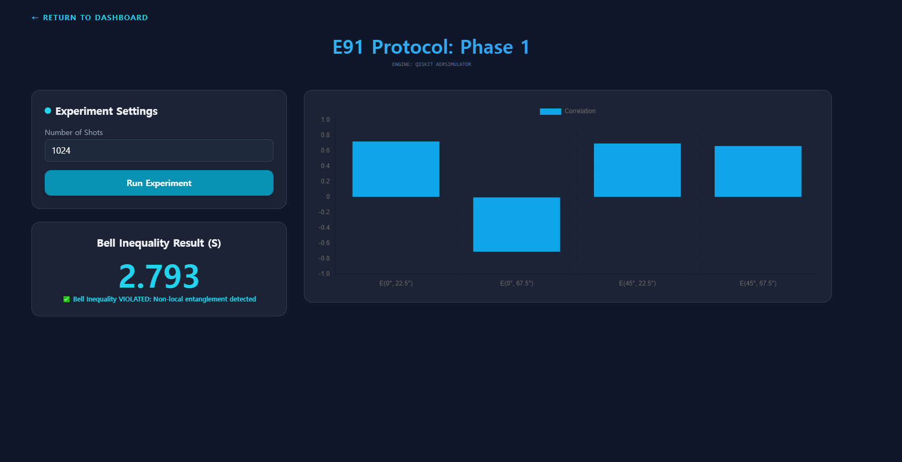
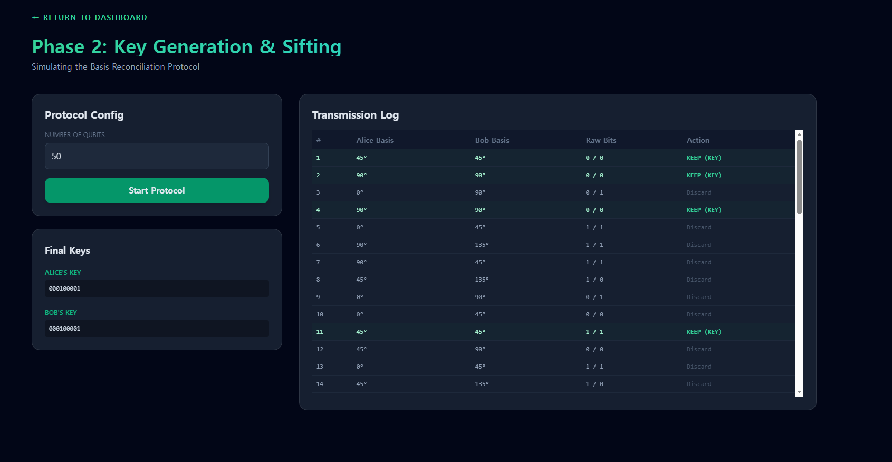
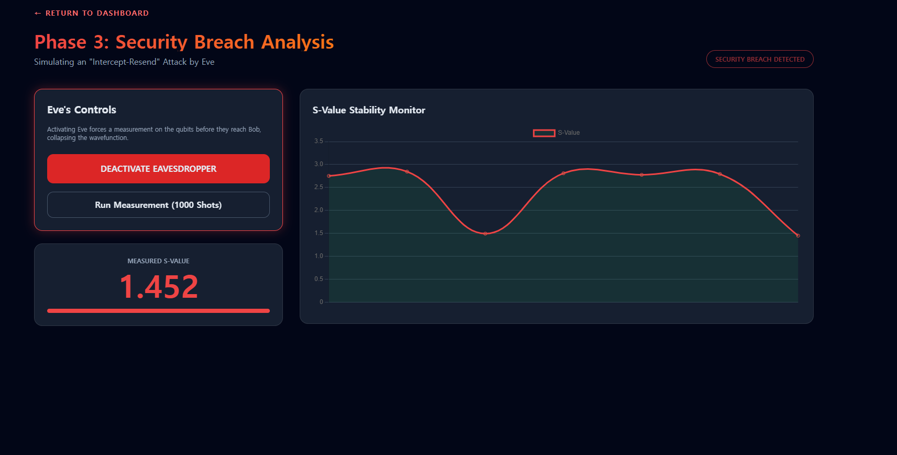

# E91 Quantum Key Distribution (QKD) Suite


## Overview

This project is a **web-based, interactive simulation suite** for **Artur Ekert’s 1991 Bell-inequality-based Quantum Key Distribution (E91) protocol**.
The interface and workflow are intentionally designed to mirror the *conceptual structure* of the E91 protocol rather than treating QKD as a black-box key generator.

All simulations are executed on a **server-side Qiskit AerSimulator**, and the results are rendered entirely in the browser. There is **no console output**; all protocol behavior is visualized through interactive charts, tables, and status indicators.

---

## Project Structure

```
e91_protocol_qkd/
│
├── index.html                    # Main dashboard (protocol overview)
├── e91_phase1.html               # Phase 1: Entanglement verification
├── e91_phase2.html               # Phase 2: Key generation & sifting
├── e91_advanced_simulation.html  # Advanced: Security breach & noise analysis
│
├── qiskit_api.py                 # Server-side Qiskit simulation engine
├── requirements.txt              # Python dependencies
├── LICENSE
```

---

## System Architecture

* **Frontend**: HTML + JavaScript (interactive UI)
* **Backend**: Python (FastAPI + Uvicorn)
* **Quantum Engine**: Qiskit AerSimulator
* **Visualization**: Chart.js

The frontend never executes quantum logic locally. All quantum circuits, measurements, and statistics are computed on the backend and returned as structured data for visualization.

---

## Application Pages & Protocol Flow

### 1. Main Dashboard (`index.html`)



The dashboard provides a conceptual overview of the E91 protocol and serves as the entry point to each experimental phase:

* **Phase 1 – Entanglement Verification**
* **Phase 2 – Key Generation & Sifting**
* **Advanced – Noise & Security Analysis**

Each module corresponds to a distinct physical or cryptographic objective, reflecting how the E91 protocol is analyzed in theory.

---

### 2. Phase 1 — Entanglement Verification (`e91_phase1.html`)



**Goal:** Verify quantum non-locality through CHSH Bell inequality violation.

* Bell state preparation using entangled qubits
* Measurements at four analyzer angle combinations
* Correlation extraction and CHSH S-value calculation

A typical result shows an S-value close to the Tsirelson bound:

```
S ≈ 2.79  → Bell inequality violated
```

This phase establishes **physical trust** in the quantum channel before key generation.

---

### 3. Phase 2 — Key Generation & Sifting (`e91_phase2.html`)



**Goal:** Generate a shared secret key using entangled measurements.

* Random basis selection by Alice and Bob
* Measurement outcome logging
* Basis reconciliation and sifting
* Extraction of matching raw key bits

The transmission log is displayed in real time, allowing inspection of which events contribute to the final key.

---

### 4. Advanced Simulation — Security Breach & Noise Analysis (`e91_advanced_simulation.html`)



**Goal:** Analyze the effect of eavesdropping and decoherence on protocol security.

* Simulated intercept-resend attack by Eve
* Real-time monitoring of S-value stability
* Visualization of Bell inequality degradation

When an attack is active, the S-value drops below the classical bound:

```
S ≈ 1.45  → Security breach detected
```

This demonstrates how E91 detects eavesdropping through loss of non-local correlations.

---

## Design Philosophy

* **Concept-first**: Each protocol phase is explicitly separated
* **No black-box outputs**: All results are interpretable and visual
* **Physics-aligned**: Security is tied directly to Bell inequality violation

This project is intended as both a **learning tool** and a **research-oriented prototype**, emphasizing clarity, correctness, and physical intuition.

---

## License

This project is released under the terms specified in the `LICENSE` file.
